# Execution Plan — 旅スポ（TABISPO）

## Detailed Analysis Summary

### Change Impact Assessment
- **User-facing changes**: Yes — これはエンドユーザー向けの新規Webアプリ全体の構築
- **Structural changes**: Yes — 新規プロジェクトのため、フロントエンドのアプリ構造を新たに作る
- **Data model changes**: 小規模 — 外部API(Google Places)のレスポンスを画面表示用に整形するモデルと、お気に入り保存（localStorage）のみ。永続DBは持たない
- **API changes**: 外部API利用のみ — Google Places API を呼び出す（自前APIの新設は無し。MVPはフロントエンド中心）
- **NFR impact**: Yes — 使用言語/フレームワークの選定が未決（要決定）、APIキー保護、モバイルでの軽快な表示

### Risk Assessment
- **Risk Level**: Low（試作・新規・隔離された小規模アプリ。失敗してもローカルで作り直せる）
- **Rollback Complexity**: Easy（ローカルのみ・依存少）
- **Testing Complexity**: Simple〜Moderate（外部API連携と位置情報のモックが要点）

---

## Workflow Visualization

### Mermaid Diagram

```mermaid
flowchart TD
    Start(["User Request"])

    subgraph INCEPTION["INCEPTION PHASE"]
        WD["Workspace Detection<br/><b>COMPLETED</b>"]
        RA["Requirements Analysis<br/><b>COMPLETED</b>"]
        US["User Stories<br/><b>SKIP</b>"]
        WP["Workflow Planning<br/><b>COMPLETED</b>"]
        AD["Application Design<br/><b>SKIP</b>"]
        UG["Units Generation<br/><b>SKIP</b>"]
    end

    subgraph CONSTRUCTION["CONSTRUCTION PHASE"]
        FD["Functional Design<br/><b>SKIP</b>"]
        NFRA["NFR Requirements<br/><b>EXECUTE</b>"]
        NFRD["NFR Design<br/><b>SKIP</b>"]
        ID["Infrastructure Design<br/><b>SKIP</b>"]
        CG["Code Generation<br/><b>EXECUTE</b>"]
        BT["Build and Test<br/><b>EXECUTE</b>"]
    end

    subgraph OPERATIONS["OPERATIONS PHASE"]
        OPS["Operations<br/><b>PLACEHOLDER</b>"]
    end

    Start --> WD
    WD --> RA
    RA --> US
    US --> WP
    WP --> AD
    AD --> UG
    UG --> FD
    FD --> NFRA
    NFRA --> NFRD
    NFRD --> ID
    ID --> CG
    CG --> BT
    BT --> OPS
    OPS --> End(["Complete"])

    style WD fill:#4CAF50,stroke:#1B5E20,stroke-width:3px,color:#fff
    style RA fill:#4CAF50,stroke:#1B5E20,stroke-width:3px,color:#fff
    style WP fill:#4CAF50,stroke:#1B5E20,stroke-width:3px,color:#fff
    style NFRA fill:#FFA726,stroke:#E65100,stroke-width:3px,stroke-dasharray: 5 5,color:#000
    style CG fill:#4CAF50,stroke:#1B5E20,stroke-width:3px,color:#fff
    style BT fill:#4CAF50,stroke:#1B5E20,stroke-width:3px,color:#fff
    style US fill:#BDBDBD,stroke:#424242,stroke-width:2px,stroke-dasharray: 5 5,color:#000
    style AD fill:#BDBDBD,stroke:#424242,stroke-width:2px,stroke-dasharray: 5 5,color:#000
    style UG fill:#BDBDBD,stroke:#424242,stroke-width:2px,stroke-dasharray: 5 5,color:#000
    style FD fill:#BDBDBD,stroke:#424242,stroke-width:2px,stroke-dasharray: 5 5,color:#000
    style NFRD fill:#BDBDBD,stroke:#424242,stroke-width:2px,stroke-dasharray: 5 5,color:#000
    style ID fill:#BDBDBD,stroke:#424242,stroke-width:2px,stroke-dasharray: 5 5,color:#000
    style OPS fill:#BDBDBD,stroke:#424242,stroke-width:2px,stroke-dasharray: 5 5,color:#000
    style INCEPTION fill:#BBDEFB,stroke:#1565C0,stroke-width:3px,color:#000
    style CONSTRUCTION fill:#C8E6C9,stroke:#2E7D32,stroke-width:3px,color:#000
    style OPERATIONS fill:#FFF59D,stroke:#F57F17,stroke-width:3px,color:#000
    style Start fill:#CE93D8,stroke:#6A1B9A,stroke-width:3px,color:#000
    style End fill:#CE93D8,stroke:#6A1B9A,stroke-width:3px,color:#000

    linkStyle default stroke:#333,stroke-width:2px
```



### Text Alternative (always included)

```
INCEPTION PHASE
- Workspace Detection ....... COMPLETED
- Requirements Analysis ..... COMPLETED
- User Stories .............. SKIP
- Workflow Planning ......... COMPLETED (current)
- Application Design ........ SKIP
- Units Generation .......... SKIP

CONSTRUCTION PHASE
- Functional Design ......... SKIP
- NFR Requirements .......... EXECUTE
- NFR Design ................ SKIP
- Infrastructure Design ..... SKIP
- Code Generation ........... EXECUTE
- Build and Test ............ EXECUTE

OPERATIONS PHASE
- Operations ................ PLACEHOLDER
```

---

## Phases to Execute

### 🔵 INCEPTION PHASE
- [x] Workspace Detection (COMPLETED)
- [x] Reverse Engineering (SKIPPED — greenfield, no existing code)
- [x] Requirements Analysis (COMPLETED)
- [x] User Stories (SKIPPED — ユーザー判断。試作のため省略)
- [x] Workflow Planning (IN PROGRESS)
- [ ] Application Design - **SKIP**
  - **Rationale**: 単一の小規模フロントエンドアプリで、コンポーネントは少数かつ明快（位置情報取得 / Places APIクライアント / 一覧UI / タブ・絞り込み / お気に入りストア）。専用の設計工程を設けずとも、Code Generationの計画パートで構造を定義できる
- [ ] Units Generation - **SKIP**
  - **Rationale**: システムは単一ユニット。複数サービス/モジュールへの分解は不要

### 🟢 CONSTRUCTION PHASE
- [ ] Functional Design - **SKIP**
  - **Rationale**: ロジックは中程度（ジャンル→Places種別のマッピング、距離ソート、営業中フィルタ、お気に入り永続化）だが、試作のためCode Generationの計画パート内で定義する。※必要なら追加可能
- [ ] NFR Requirements - **EXECUTE**
  - **Rationale**: **保留にしていた言語/フレームワークの選定**を行う最重要工程。あわせてAPIキー保護方針・モバイルでの軽快さ等の非機能要件を確定する
- [ ] NFR Design - **SKIP**
  - **Rationale**: 対象は局所的なフロントエンドMVP。主要なNFRパターン（APIキーのGoogle側制限、入力のデバウンス等）はNFR要件で方針化し、実装時に直接反映する
- [ ] Infrastructure Design - **SKIP**
  - **Rationale**: ローカル動作でよく（Q22=A）、クラウドインフラの構築は範囲外
- [ ] Code Generation - **EXECUTE** (ALWAYS)
  - **Rationale**: 実装の計画とコード生成が必要
- [ ] Build and Test - **EXECUTE** (ALWAYS)
  - **Rationale**: ビルド・テスト・動作確認が必要

### 🟡 OPERATIONS PHASE
- [ ] Operations - **PLACEHOLDER**
  - **Rationale**: 将来のデプロイ・監視ワークフロー用（現時点では対象外）

---

## Estimated Timeline
- **Total Stages to Execute (残り)**: 3（NFR Requirements → Code Generation → Build and Test）
- **Estimated Duration**: 短期（試作・単一ユニット）。NFR要件で技術選定 → コード生成 → ビルド/テストの順で進行

## Success Criteria
- **Primary Goal**: 「起動 → 現在地取得 → 周辺の観光/グルメをジャンル別に一覧表示」が動作する旅スポMVPを完成させる
- **Key Deliverables**:
  - 技術スタックを確定したNFR要件
  - 動作するフロントエンドWebアプリのコード（位置情報・Places連携・タブ/絞り込み・距離ソート・営業中フィルタ・お気に入り・エラー/再試行）
  - ビルド手順とテスト
- **Quality Gates**:
  - 位置情報の取得と拒否時フォールバック（地名入力）が動作する
  - 観光/グルメの両カテゴリが起動時に取得され、ジャンル別に表示される
  - 0件・通信エラー時にメッセージ＋再試行が表示される
  - お気に入りの保存・表示・解除が端末内で機能する
